# 京都・大阪 公共交通乘车攻略（v1）

> **版本**：v1　|　**整理日期**：2026-09-11　|　**类型**：乘车实操攻略（面向第一次去日本的中国人）
> **覆盖范围**：关西实操（京都 / 大阪 / 关西机场 / 奈良・神户顺路）＋ 全国铁路常识（新干线、JR 各社、私铁、地下铁）
> **来源规则**：正文用〔S#〕标注出处，关键结论要求 3 条独立来源（至少 1 条官方），文末给出完整来源清单与核验矩阵；来源之间有差异时在正文写明差异。
> **阅读标记**：✅ = 三源一致（含官方）；⚠️ = 基本可用但来源有出入或仅 2 源；❗ = 未能三源确认，出行前请自行核对；⏰ = 票价 / 时刻 / 规则类信息，行前 1–7 天再确认一次；【建议】= 通用经验建议。
> **原始底稿**：本文件由《日本京都·大阪公共交通乘车完全攻略》（DeepSeek 整理稿，2026-09-10）重排、扩充并按官方来源校正而成，原稿原样保留在 `Osaka-Kyoto-Transit-Guide-v0-Source-Original.md`。

---

## 目录

1. [三条铁律：看完这页就能上车](#1-三条铁律看完这页就能上车)
2. [标识图解：日本交通标志一眼认](#2-标识图解日本交通标志一眼认)
3. [改札与闸机完全解读](#3-改札与闸机完全解读)
4. [坐电车的完整流程（四条路径）](#4-坐电车的完整流程四条路径)
5. [列车种类详解：普通车、快速、特急、新干线到底差在哪](#5-列车种类详解普通车快速特急新干线到底差在哪)
6. [关西主要线路怎么买票怎么坐](#6-关西主要线路怎么买票怎么坐)
7. [坐巴士：京都和大阪规则一样吗](#7-坐巴士京都和大阪规则一样吗)
8. [换乘与车站动线：三种换乘完全不同](#8-换乘与车站动线三种换乘完全不同)
9. [交通 IC 卡：ICOCA、Suica 与手机 IC](#9-交通-ic-卡icocasuica-与手机-ic)
10. [对号入座与座位规则](#10-对号入座与座位规则)
11. [遇到问题怎么办（现场处置手册）](#11-遇到问题怎么办现场处置手册)
12. [中国人最容易踩的坑（校正版清单）](#12-中国人最容易踩的坑校正版清单)
13. [行前工具与话术模板](#13-行前工具与话术模板)
14. [中日英对照速查表（含假名读音）](#14-中日英对照速查表含假名读音)
15. [来源清单、核验矩阵、图片版权与更新记录](#15-来源清单核验矩阵图片版权与更新记录)

---

## 1. 三条铁律：看完这页就能上车

日本交通看起来复杂，真正会让你「当场卡住」的其实只有三件事。先把这三条背下来，剩下的都是细节。

1. **「改札」= 检票口，「改札机」= 国内那种闸机。** 进站出站都要过一次闸机，有人改札口就是人工通道，出问题时走那里。
2. **IC 卡（ICOCA / Suica）是「碰」不是「塞」。** 卡放在闸机顶部感应区轻轻贴一下，不要插进插票口；插进去的是纸质车票。〔S1〕〔S2〕
3. **不同公司的线路之间换乘，通常要「先出闸、再进闸」。** 同一家公司的站内换乘不用出闸；还有第三种情况叫「直通运转」，车直接开过去、你连车都不用换。〔S11〕〔S16〕〔S38〕

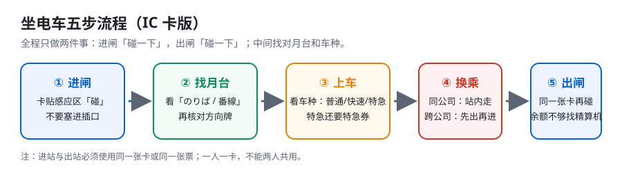

> **一句话版本**：改札＝闸机；刷卡＝碰一下；跨公司＝先出再进；特急和新干线＝要另外买券。

### 1.1 本文怎么用

- **出发前**：读第 9（IC 卡）、第 10（对号入座）、第 13（行前工具），把该买的东西买好。
- **在机场**：读第 4、第 6 章，照着「KIX → 京都 / 大阪」那几段走。
- **在车站现场**：读第 2（标识）、第 3（闸机）、第 11（出问题怎么办），直接翻对应小节。
- **带长辈/小孩同行**：重点看第 7（巴士）与第 10（座位），这两处最容易出岔子。

---

## 2. 标识图解：日本交通标志一眼认

日本车站的标识体系是「公司标志 + 线路颜色 + 汉字/假名 + 英文字母编号」四层叠加。你只要认出公司标志和颜色，基本就不会走错闸机。

### 2.1 先认公司：看到这个标志就是这家公司的闸机

**JR 集团（全国性）**：JR 是「Japan Railways」的缩写，1987 年国铁民营化后拆成 7 家公司。三家你一定会遇到：**JR 西日本**（关西、山阳、北陆，蓝色）、**JR 东海**（名古屋、静冈、新干线，橙色）、**JR 东日本**（关东、东北，绿色）。〔S1〕〔S19〕〔S22〕

三家公司的完整公司标志（买票、看指示牌时都会出现）：

**公营地下铁**：大阪地铁已公司化，标志为 **Osaka Metro**（深蓝底、白色 M 造型）；京都市营地下铁有自己的乌丸线（绿）、东西线（红）标志。〔S13〕〔S9〕

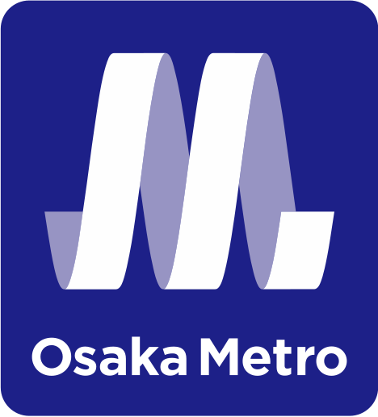

**关西主要私铁**：阪急（栗色）、京阪（绿/红）、近铁（红）、南海（蓝）、阪神（黑/黄）。它们和 JR、地铁是**互相独立的公司**，闸机分开、票价分开算。〔S26〕〔S29〕〔S22〕〔S24〕〔S28〕

**巴士**：大阪市内的城市巴士由 **大阪 City Bus** 运营（原 Osaka Metro 巴士部门），标志如下；京都则是京都市交通局的市巴士（车身淡绿色）。〔S20〕〔S7〕

### 2.2 车站导视牌怎么读

一块典型的换乘指示牌上，信息是固定顺序排列的：**先看公司色和线路名 → 再看目的地方向 → 再看几号月台 → 最后看出口编号**。

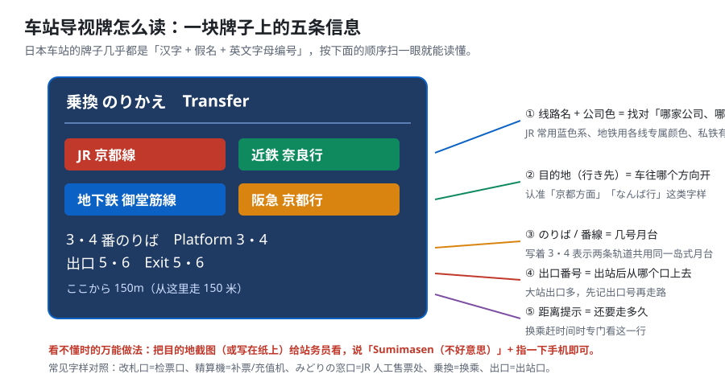

现场实拍（京都站月台，站台门与线路标识）：

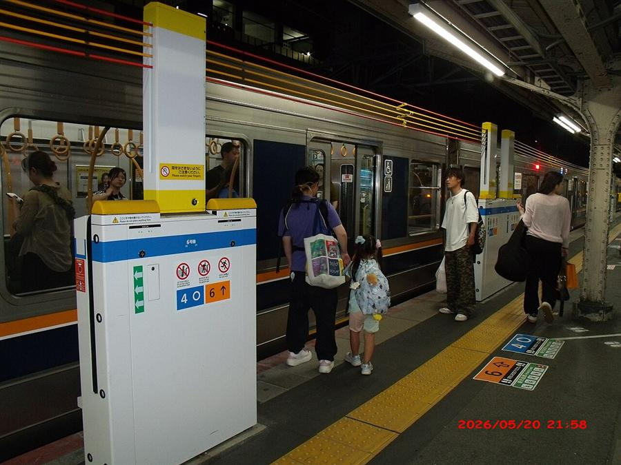

**最常遇到的 8 个日语标识**：

| 日语标识 | 读音 | 中文意思 | 你要做什么 |
|---|---|---|---|
| 改札口 | かいさつぐち | 检票口 | 进站/出站的地方 |
| 乗換 | のりかえ | 换乘 | 看箭头走通道，可能要先出闸 |
| のりば / 番線 | のりば / ばんせん | 月台 / 股道号 | 认准几号月台再上车 |
| 出口 | でぐち | 出口 | 大站记住出口编号 |
| 精算機 | せいさんき | 补票・结算机 | 余额不足、坐过站时用 |
| みどりの窓口 | みどりのまどぐち | JR 人工售票处 | 买特急券、指定席、退卡 |
| 券売機 | けんばいき | 自动售票机 | 买纸质票、充值 IC 卡 |
| 終電 / 始発 | しゅうでん / しはつ | 末班车 / 首班车 | 夜间行程务必先查 |

### 2.3 车厢与座位标识

| 标识 | 含义 | 注意 |
|---|---|---|
| 指定席 | 对号入座 | 票面写「○号車 ○番」 |
| 自由席 | 随便坐 | 有空位就坐，站票也可 |
| グリーン車 | 绿色车厢（头等） | 需另买绿色券 |
| 女性専用車 | 女性专用车（特定时段/车厢） | 男性不要上，具体车厢看站台地面标识〔S19〕 |
| 優先席 | 优先座 | 老人、孕妇、带小孩者优先，让座很正常〔S6〕 |
| 荷物置き場 | 行李放置区 | 新干线部分车厢设有 |

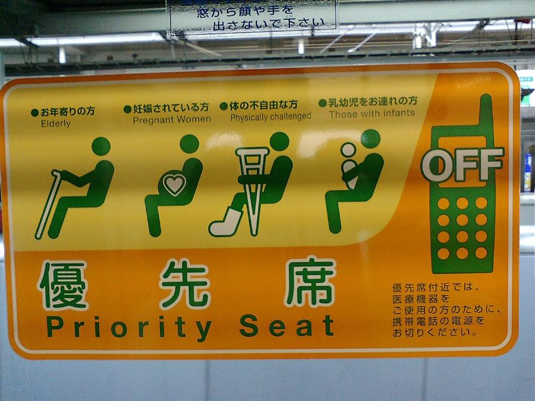

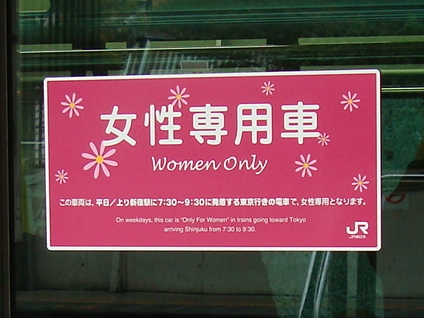

---

## 3. 改札与闸机完全解读

### 3.1 自动改札机的四个部位

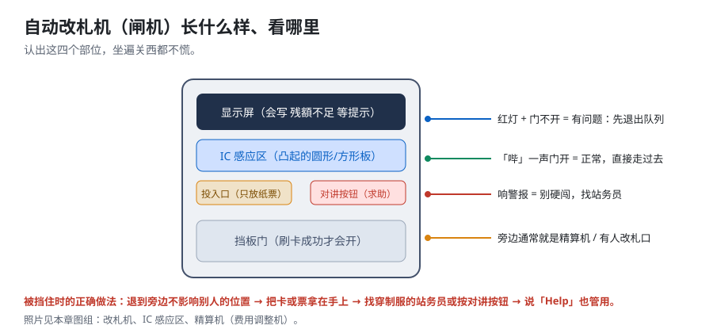

**最容易搞错的动作**：IC 卡是「碰」，纸票才是「塞」。

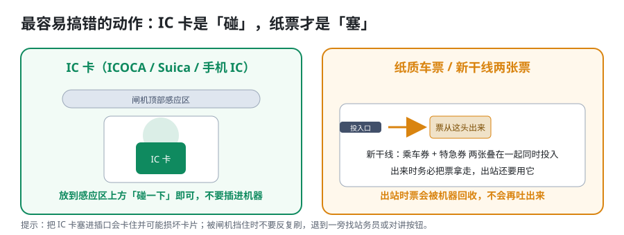

| 部位 | 作用 | 中国游客最容易犯的错 |
|---|---|---|
| 顶部感应区（IC リーダー） | 刷 IC 卡 / 手机 IC | 把卡往插票口塞 |
| 投入口（券投入口） | 塞纸质车票 | 忘了拿走弹出来的票 |
| 显示屏 | 显示余额不足、进站记录等 | 挡住后面的人反复刷 |
| 对讲按钮 / 有人改札 | 求助站务员 | 硬闯或翻越闸机 |

实拍：自动闸机与 IC 感应区（把卡放在凸起的感应板上即可）。

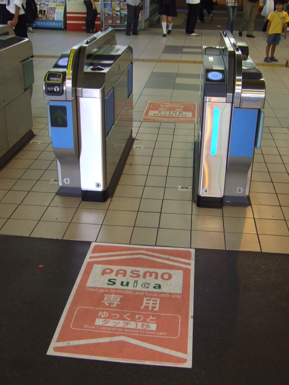

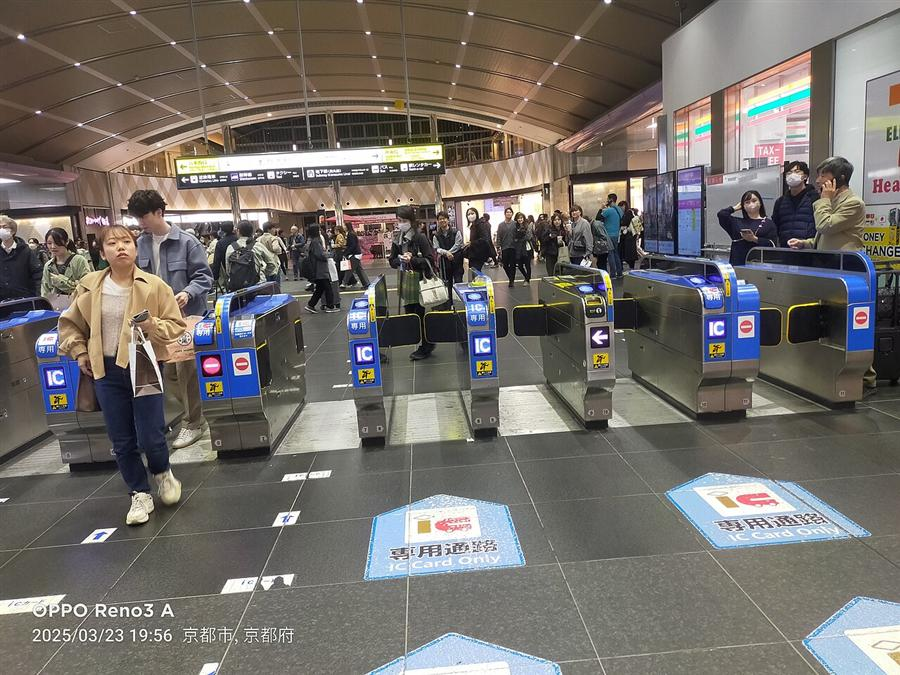

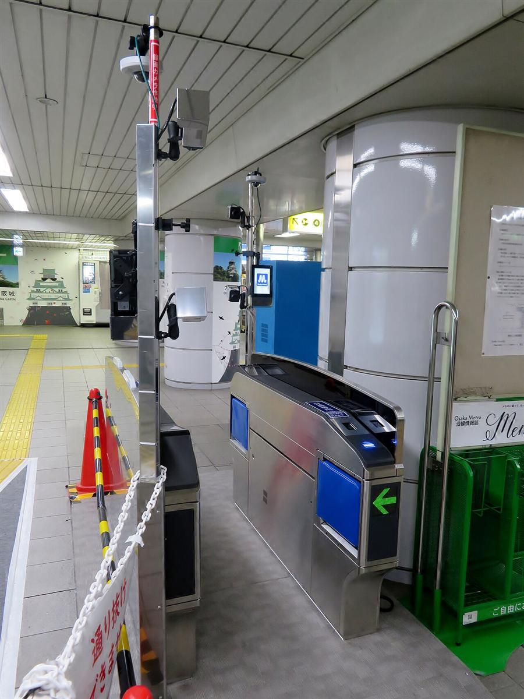

### 3.2 闸机的三种反应

| 闸机反应 | 什么意思 | 正确做法 |
|---|---|---|
| 「哔」一声，门开 | 正常 | 直接走过去，不要停留 |
| 红灯亮、门不开 | 余额不足 / 没有进站记录 / 票不对 | **不要反复刷**，退到旁边，找精算机或站务员 |
| 响警报 | 卡片或车票异常 | 同上，别硬闯 |

> **被拦住时的标准动作**：退出队列 → 把卡/票拿在手里 → 找穿制服的站务员或按对讲按钮 → 说「Help」或指一下屏幕上的红字。大阪地铁等公司也在官网专门写了「自动改札机请这样使用」，站务员每天处理大量游客问题。〔S16〕

### 3.3 精算机（补票机）怎么用

精算机（せいさんき / Fare Adjustment）一般就在出站闸机旁或售票机区域，用来**补差价**或**充值**。

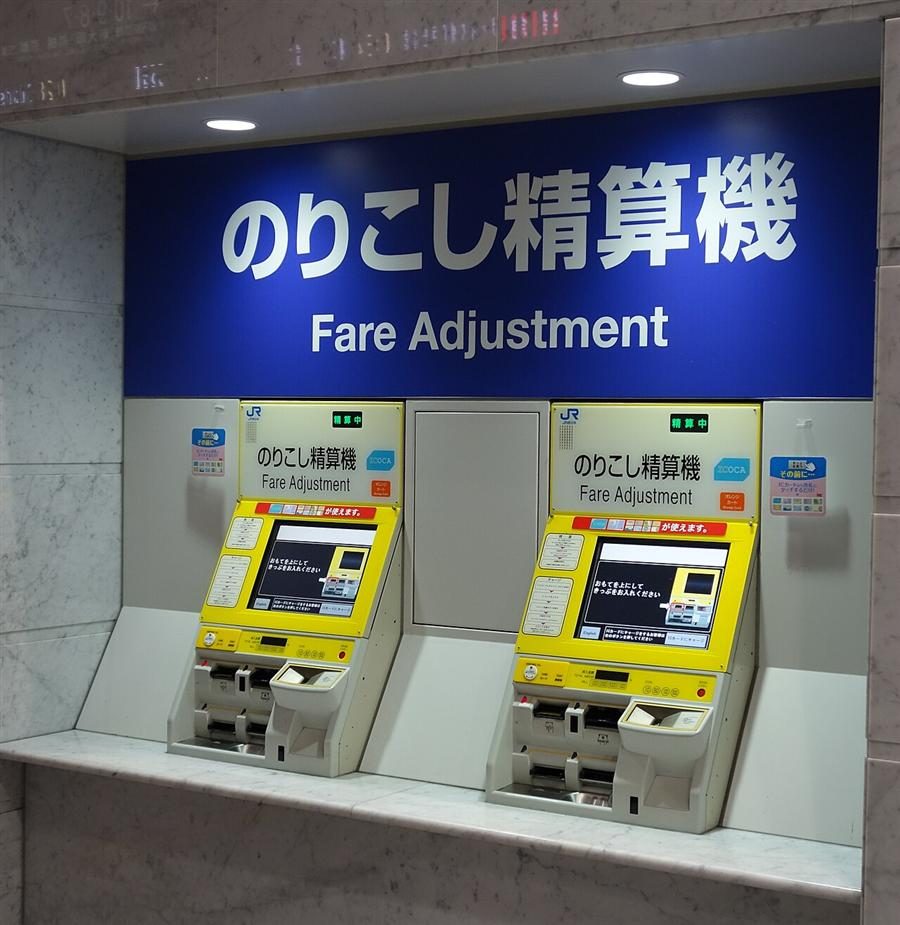

1. 把车票插进精算机（IC 卡则放在感应区）。
2. 屏幕显示需要补的金额，投入现金。
3. 机器吐出新的车票 → 拿新票重新过闸出站。
4. IC 卡余额不足时同样是「先充值、再重新刷卡出站」。

### 3.4 充值（チャージ）在哪里做

车站自动售票机、精算机、便利店收银台都可以给 IC 卡充值。充值只能用**现金或对应信用卡**，不能刷支付宝/微信。实拍：ICOCA 充值机。〔S1〕〔S2〕

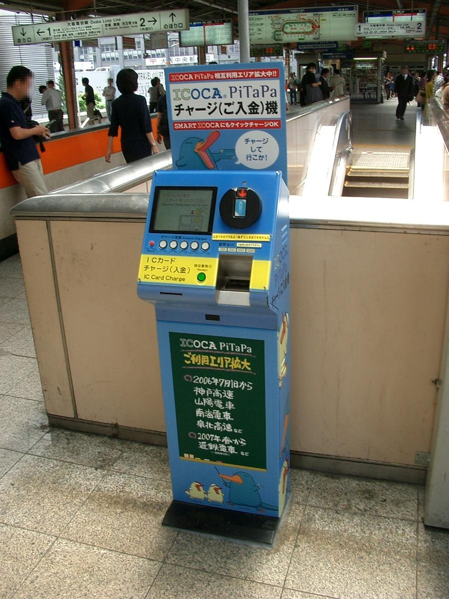

---

## 4. 坐电车的完整流程（四条路径）

日本电车有四种「介质」，流程各不相同：**IC 卡 / 纸质票 / 手机 IC / QR 电子票**。搞清楚你手上是哪一种，就不会乱。

### 4.1 路径一：IC 卡（ICOCA / Suica）— 最推荐

1. **进闸**：卡贴感应区碰一下，听「哔」声、门开，走过去。
2. **看指示牌**：确认线路方向与月台号（のりば）。
3. **上车前确认车种**：普通 / 快速 / 新快速 / 特急——坐错车种会不停你要下的站，或者需要补特急券。
4. **出闸**：同一张卡再碰一次，系统自动扣费。
5. **余额不足**：闸机不开 → 去精算机充值 → 回来重新刷。

> **一条硬规则**：**用什么进站，就用什么出站**。刷 IC 卡进站必须刷同一张卡出站；用纸票进站必须用同一张纸票出站。两种混用闸机不会开门。〔S10〕

### 4.2 路径二：纸质车票

1. 在自动售票机（券売機）上方的票价表找到目的站票价 → 按对应金额 → 投币或插纸币。
2. 进闸：把票插入投入口，**票会从另一头弹出来，一定要拿走**。
3. 出闸：再次插入，票被机器回收（不再吐出）。
4. 坐过站：用精算机补差价，拿新票出站。

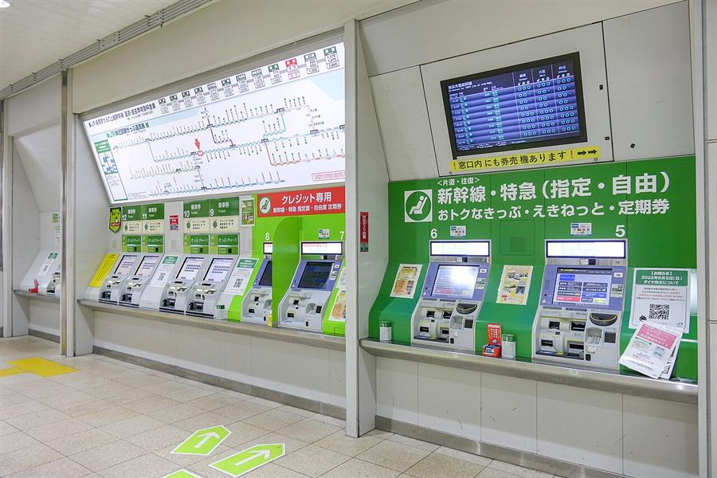

### 4.3 路径三：手机 IC（Apple Pay / モバイルICOCA）

- **iPhone / Apple Watch**：在「钱包」App 里直接开一张 Suica 或 ICOCA（Apple Pay 版 ICOCA 自 2023-06-27 起提供），开卡免费、无押金，用 Apple Pay 充值。〔S3〕
- **安卓**：JR 西日本官方「モバイルICOCA」App（Android 10 以上，需注册会员并绑定信用卡）。〔S4〕
- 用法与实体卡一样：贴闸机感应区；电量耗尽会失效，出门前充满电，行程中可备一张实体卡兜底。【建议】

### 4.4 路径四：QR / 电子票（较少用）

大阪地铁等有官方电子乘车券（e METRO），部分一日券、周游卡是二维码形式，扫专用闸机或给窗口看，**这套系统和 IC 卡是两套体系**，同一行程不要混着用。〔S41〕〔S42〕〔S21〕

---

## 5. 列车种类详解：普通车、快速、特急、新干线到底差在哪

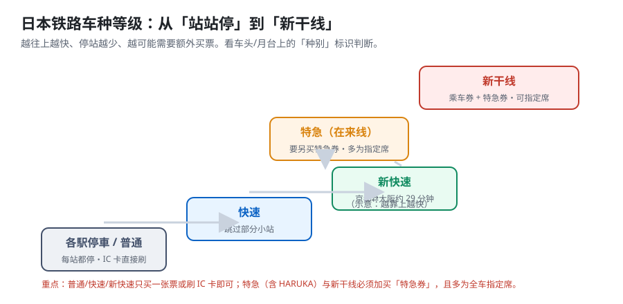

### 5.1 先分清「铁路公司」和「车种」两件事

| 分类维度 | 有哪些 | 对你意味着什么 |
|---|---|---|
| 按公司 | JR（西日本/东海/东日本等）、私铁（阪急・京阪・近铁・南海・阪神）、公营→公司化地下铁（Osaka Metro、京都市营地下铁）、单轨/有轨电车 | 决定**闸机在哪、票价怎么算**；不同公司一般要出闸再进闸〔S16〕〔S11〕 |
| 按速度等级（种别） | 各駅停車/普通 → 快速 → 新快速 → 特急 → 新干线 | 决定**停不停你要下的站、要不要另买券** |
| 按座位 | 自由席、指定席、全车指定席、绿色车厢 | 决定**能不能随便坐、要不要对号** |

### 5.2 新干线：不是「另一种地铁」，是一套独立系统

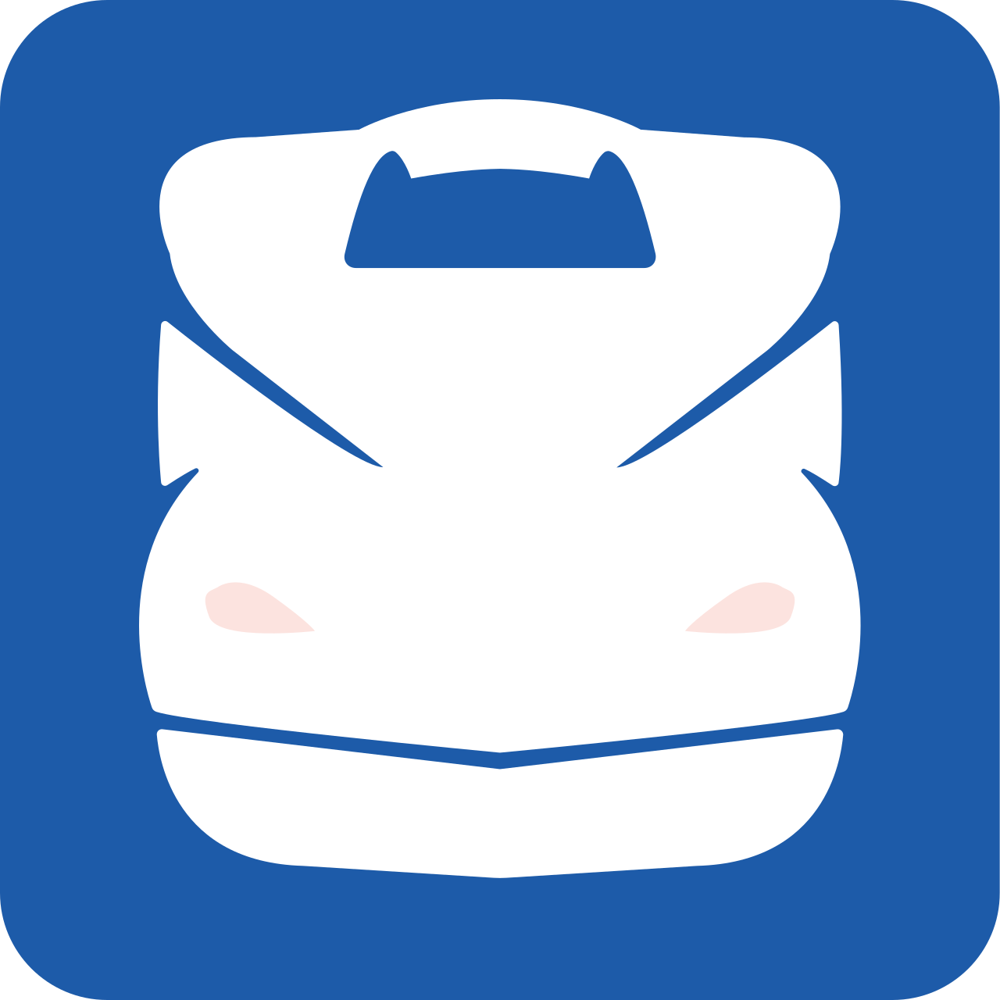

- **新干线必须另外买票**：乘车券 + 特急券（纸票是两张，进闸时要**叠在一起同时投入**；出闸时票会退出，记得拿走）。⚠️〔S32 附近规则见官方行李页与 EX 服务页〕
- **IC 卡不是完全不能用**：用 **スマートEX / EX-IC**（需注册信用卡）可以把 IC 卡当作新干线的乘车介质，进闸时用 IC 卡触碰即可；但**单独拿一张 ICOCA/Suica 直接刷普通新干线闸机是进不去的**。〔S33〕〔S34〕
- **车种（号别）差别**：以东海道/山阳新干线为例，希望号（のぞみ）停站最少、光号（ひかり）次之、回声号（こだま）站站停；山阳侧还有瑞穗（みずほ）、樱花（さくら）。**同一区间不同号别所需时间差别很大**，买票时看清号别。❗（具体车种与自由席设置会调整，以当日官方信息为准）
- **特大行李规则（必须记住）**：行李箱「长+宽+高」合计 **161–250cm** 属于特大行李，坐东海道・山阳・九州新干线**必须预约「特大行李位」**（部分希望号/光号/回声号的指定席车厢设有）；**没预约就带上去会被收 1,000 日元行李手续费**。160cm 以内放头顶行李架或座位前即可。〔S32〕

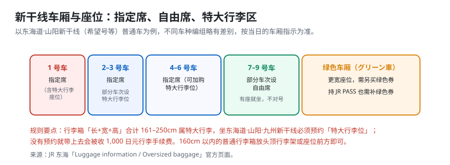

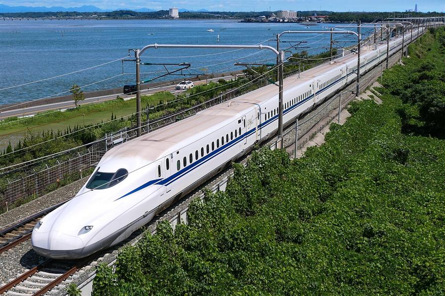

### 5.3 在来线特急：多花一笔「特急券」，座位大多要对号

| 列车 | 运行区间 | 座位规则 | 关键提醒 | 来源 |
|---|---|---|---|---|
| HARUKA（はるか） | 关西机场 ⇄ 京都・新大阪 | **全车指定席**（1 号车绿色车厢指定席，2–6 号车普通车指定席） | 关西机场到京都最省事的直达选择；需买乘车券＋特急券 | 〔S5〕 |
| Rapi:t（ラピート） | 难波 ⇄ 关西机场 | 全车指定席（含更高级的超级座席） | 特急券约 700 日元起、超级座席更贵；**车内补票加收 300 日元**，用官方「チケットレス」可便宜 150 日元 | 〔S24〕〔S25〕 |
| 近铁特急（ひのとり等） | 大阪难波/京都 ⇄ 奈良・名古屋・伊势 | **全席座位指定** | 必须**乘车前**买好特急券，车上不能随便坐 | 〔S22〕〔S23〕 |
| Thunderbird（サンダーバード） | 大阪 ⇄ 京都 ⇄ 北陆方向 | 指定席＋自由席 | 北陆方向用；不需对号时可买自由席 ⚠️ | ❗ 仅供参考 |

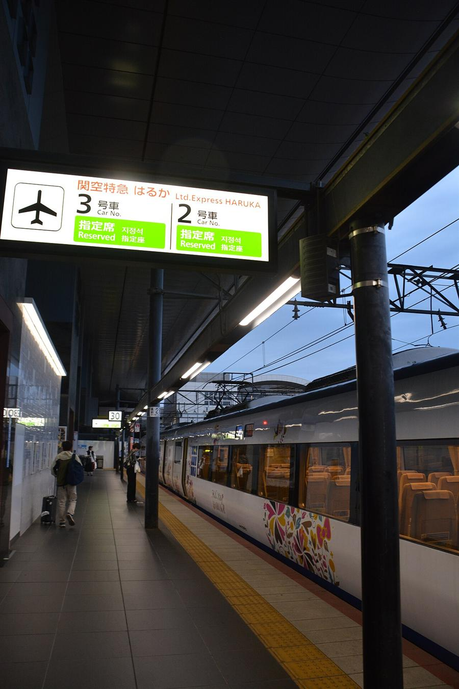

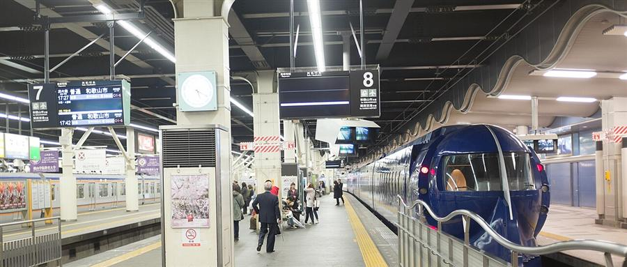

> **一句话判断**：车头上写着「特急」的，**几乎都要另买特急券**；写着「新快速 / 快速 / 普通」的，只要一张票或刷 IC 卡就行。

### 5.4 快速、新快速、普通：只是停站不同，票价一样

- **普通（各駅停車）**：每站都停。
- **快速**：跳过部分小站。
- **新快速**：跳站更多，京都 ⇄ 大阪之间最常用（约 29 分钟，视车次而定 ⚠️）。
- 这三类在同一区间**票价相同**，刷 IC 卡直接进出即可，不需要额外买券。

【实用提醒】同一月台常有不同车种混跑，**上车前看清车头显示和月台屏幕上的「种别」**，坐错车种会「过站不停」——补救办法见第 11 章。

### 5.5 JR 与私铁、地下铁的实际差别

| 对比 | JR | 私铁（阪急/京阪/近铁/南海/阪神） | 地下铁（Osaka Metro / 京都市营） |
|---|---|---|---|
| 关西主要用途 | 京都⇄大阪、机场特急、环状线 | 京都⇄大阪（阪急/京阪）、奈良（近铁）、机场（南海） | 市内移动 |
| IC 卡 | 可用 | 可用 | 可用 |
| 票价体系 | 独立 | 独立，通常比 JR 略便宜 | 按距离 190–390 日元（大阪）〔S14〕〔S15〕 |
| 换乘 | 同公司站内换乘 | 跨公司要出闸再进闸 | 与私铁有「直通运转」线路，见 8.3 |

**「直通运转」是什么**：不同公司的线路连在一起，列车直接从 A 公司开到 B 公司，乘客**不用下车、不用出闸**。例：Osaka Metro 御堂筋线直通北大阪急行〔S38〕；京都市营地下铁东西线直通京阪京津线（京阪山科—三条京阪段按直通计价，官方 FAQ 有专门说明）〔S11〕。拿着 IC 卡坐这类车，票价会按直通规则一次结算。

### 5.6 观光列车：嵯峨野小火车（岚山方向）

- **全车指定席**：必须提前订座，没有「随便坐」的车厢。〔S35〕
- **发售时间**：个人票在**乘车日前 1 个月**开始发售；网上预约可指定车厢与座位。〔S35〕〔S36〕
- **售完时**：当天在各站（保津峡站除外）可能卖**站票**。〔S35〕
- **当天购票**：嵯峨/岚山/龟冈站窗口可用现金、信用卡和交通系 IC 卡（PiTaPa 不可用）。〔S35〕

---

## 6. 关西主要线路怎么买票怎么坐

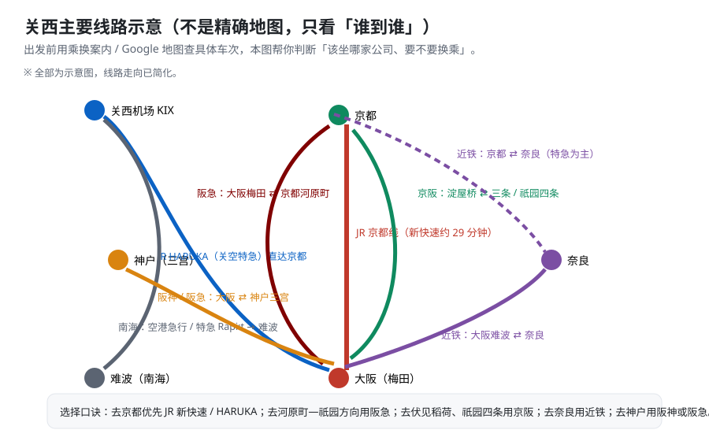

### 6.1 关西机场（KIX）→ 京都 / 大阪：三种主流打法

| 方案 | 路线 | 时间 | 适合谁 | 买票方式 | 来源 |
|---|---|---|---|---|---|
| **A. HARUKA 特急** | KIX → 京都站（直通，经新大阪） | 约 80 分钟 ⚠️ | 行李多、直接去京都 | 乘车券＋特急券（全车指定席），可在窗口/网上买 | 〔S5〕〔S37〕 |
| **B. 机场利木津巴士** | KIX → 京都站八条口 | 约 1 小时 25 分–1 小时 30 分 | 不想拖行李换乘、酒店在京都站附近 | 关西机场交通（KATE）窗口/网上购票；京都八条口窗口可用信用卡 | 〔S37〕 |
| **C. 南海 + 市内换乘** | KIX → 难波（南海 空港急行 / Rapi:t）→ 地铁御堂筋线去梅田/心斋桥 | 视换乘而定 | 先去大阪市区 | 南海段用 IC 卡或车票；Rapi:t 需特急券 | 〔S24〕〔S25〕 |

【建议】第一次去、酒店在京都站附近 → 选 A 或 B；住在难波/心斋桥 → 选 C。行李超过 160cm 要坐新干线时，别忘了第 5.2 节的预约规则。

### 6.2 京都 ⇄ 大阪：三条“平行线路”，按目的地选

| 方式 | 起终点（约） | 特点 | 票价/支付 |
|---|---|---|---|
| **JR 新快速** | JR 京都站 ⇄ JR 大阪站 | 最快，班次密；大阪站直连梅田商圈 | 刷 IC 卡 / 买票 |
| **阪急电铁** | 京都河原町 ⇄ 大阪梅田 | 直达四条河原町、祇园一带（换乘巴士方便） | 刷 IC 卡 / 买票〔S26〕 |
| **京阪电铁** | 出町柳/祇园四条/三条 ⇄ 淀屋桥 | 适合伏见稻荷、东福寺、祇园方向 | 刷 IC 卡 / 买票〔S29〕 |

> **站名陷阱**：JR 的「大阪站」、阪急/阪神的「大阪梅田站」、Osaka Metro 的「梅田站」是**三个不同车站**，虽然都在梅田一带，步行换乘要 5–10 分钟。查路线时先看清楚是哪家公司的哪个站。【建议】

### 6.3 大阪市内：地铁为主，巴士为辅

- **Osaka Metro 票价**：按距离分 190 / 240 / 290 / 340 / 390 日元五档（成人）；儿童半价（100–200 日元）。〔S14〕〔S15〕
- **大阪周游卡（Osaka Amazing Pass）**：1 日券 **3,500 日元**、2 日券 **5,000 日元**，含地铁/巴士随便坐＋约 40 个景点入场，是否值得取决于你一天能进几个景点。〔S21〕
- **女性专用车**：Osaka Metro 部分线路设有女性专用车，站台地面会标注车厢位置，男性不要上。〔S19〕

### 6.4 京都市内：巴士是主力，地铁与其一票通用

- **市巴士均一区间**：成人 **230 日元**、儿童 120 日元；观光特急巴士 500 日元；多区间系统按距离计费。〔S7〕〔S8〕〔S11〕
- **地下铁**：按距离 **220–360 日元**（儿童 110–180）。〔S9〕〔S11〕
- **优惠票**：地下铁 1 日券 **800 日元**；地下铁・巴士 1 日券 **1,100 日元**（含京都市巴士全线和部分京都巴士/京阪巴士/西日本 JR 巴士）。〔S12〕〔S13〕〔S11〕
- **怎么选**：一天坐 4 次以上巴士（约 920 日元）就该算一下 1 日券；只坐 2–3 段，直接刷 IC 卡更划算。【建议】
- **换乘**：乌丸线与东西线在**乌丸御池站**可以不出闸直接换乘。〔S9〕
- ⏰**注意（尚未定案）**：日本媒体与业界讨论中提到京都市在研议调整市巴士票价制度（含面向游客的差别定价方案，目标 2027 年度），目前**不是已实施规则**；2027 年之后出行请重新核对官方公告后再算票券性价比。❗

一日券实物（京都巴士一日券背面）：

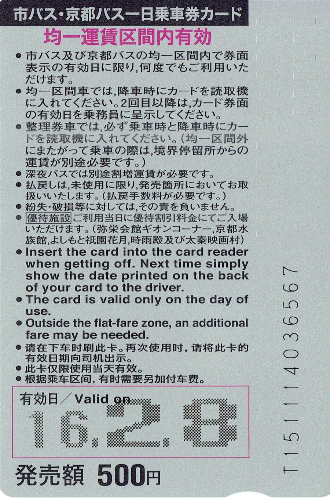

### 6.5 顺路去奈良 / 神户

| 目的地 | 推荐方式 | 备注 |
|---|---|---|
| 奈良 | 近铁（大阪难波 ⇄ 近铁奈良、京都 ⇄ 近铁奈良） | 近铁特急全席指定，普通车刷 IC 卡即可〔S22〕 |
| 神户 | 阪神 / 阪急（大阪梅田 ⇄ 神户三宫） | 与 JR 是不同公司，出闸再进闸 ⚠️ |

---

## 7. 坐巴士：京都和大阪规则一样吗

**结论：一样。**很多人以为「京都后门上、大阪前门上」，实际上**两地的城市巴士都是「后门上车 → 前门下车 → 下车时付款」**。〔S7〕〔S20〕

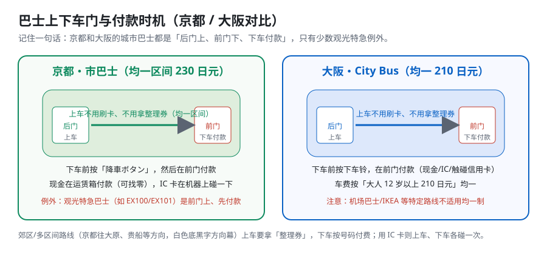

### 7.1 京都市巴士

- **上车门**：后门；**下车门**：前门；**付款时机**：下车时（后払い）。〔S7〕
- **票价**：均一区间 成人 230 日元 / 儿童 120 日元；观光特急巴士（EX100/EX101 等）成人 500 日元，且是**前门上车、上车先付**。〔S7〕〔S8〕
- **怎么判断是不是均一区间**：看车头方向幕颜色——**橙底白字＝循环系统、蓝底白字＝均一系统**（都在均一区间内）；**白底黑字＝多区间系统**，可能要拿整理券。〔S11〕
- **多区间系统**：上车时在后门抽一张**整理券**，下车看车内票价屏按号码付费；用 IC 卡则**上车、下车各碰一次**，不用拿券。〔S11〕
- **付款**：现金投运赁箱（可找零 ⚠️）、IC 卡贴机器、一日券给司机看。
- ⏰同上：若未来市巴士票价制度调整（见 6.4 提示），均一票价与一日券性价比都要重新计算；以京都市交通局官方公告为准。❗

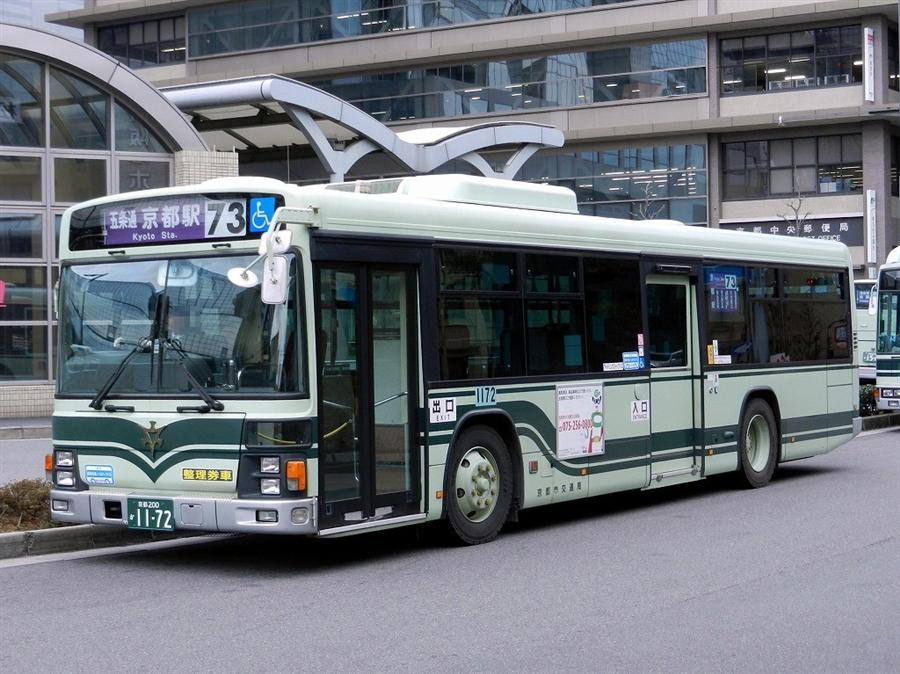

### 7.2 大阪 City Bus

- **上车门**：后门；**下车门**：前门；**付款时机**：下车时。〔S20〕
- **票价**：全区间均一，**大人（12 岁以上）210 日元**；可用现金、IC 卡、支持触碰支付的信用卡。〔S20〕
- **上车不需要**拿整理券，也**不需要**刷 IC 卡或信用卡——这是官方页面明确写的。〔S20〕
- **例外**：机场线、IKEA 鹤滨线等特定路线不适用均一制。〔S15〕〔S20〕

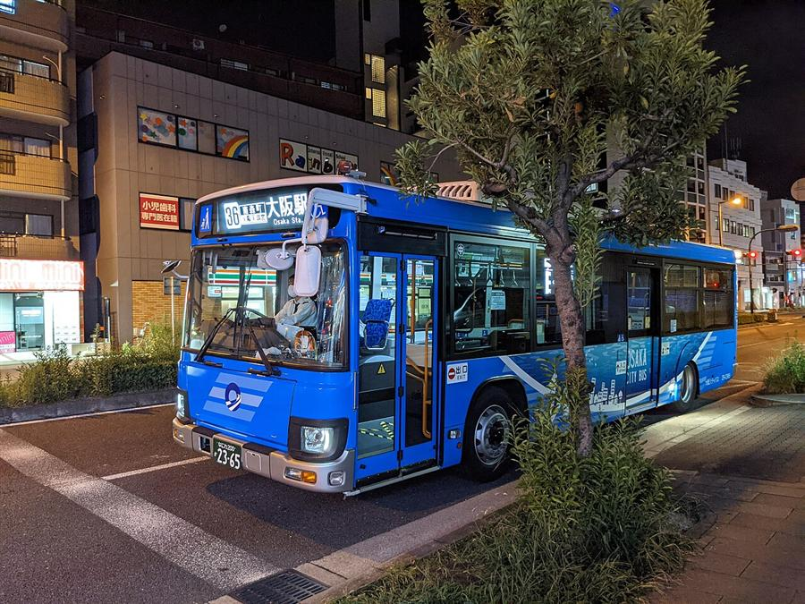

### 7.3 坐巴士的通用要点

1. **下车铃（降車ボタン）**：不按铃，司机可能直接过站；快到站时按一下。
2. **刷卡位置**：IC 卡在司机旁的读卡器上碰一下即可（京都多区间需上下车各一次）。
3. **车内禁打电话**：日本巴士/电车车厢内禁止通话，手机请静音。【建议】〔S6〕
4. **前门下车排队**：车停稳后再起身，从前方依次下车。

---

## 8. 换乘与车站动线：三种换乘完全不同

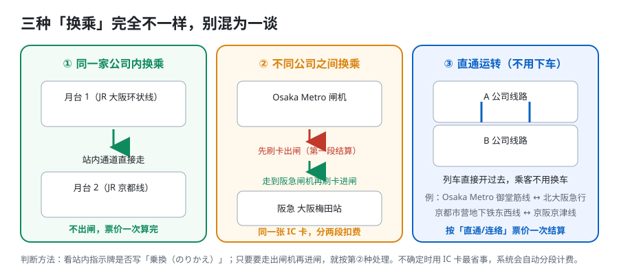

### 8.1 同一家公司内换乘（不出闸）

同一家公司（例如都在 JR 西日本、或都在 Osaka Metro）内部换线，**不用出闸**，站内沿着「乗換」指示牌走到另一条线的月台即可，票价按整段行程一次计算。〔S16〕〔S9〕

例：京都地下铁乌丸线 ⇄ 东西线，在乌丸御池站不出闸换乘。〔S9〕

### 8.2 不同公司之间换乘（先出闸、再进闸）

JR ⇄ 私铁 ⇄ 地下铁之间的换乘，**必须先从一家公司的闸机出站，再走到另一家的闸机重新进站**，因为两家独立计费。用同一张 IC 卡即可，系统会自动分两段扣费（第一段出闸结算，第二段进闸重新开始）。〔S16〕〔S17〕

### 8.3 直通运转（连车都不用换）

部分线路是「直通运转」：列车跨公司开行，**你坐在车上不用动**，票价按直通规则结算。

- Osaka Metro 御堂筋线 ⇄ **北大阪急行**（往千里中央方向）。〔S38〕
- 京都市营地下铁东西线 ⇄ **京阪京津线**（京阪山科—三条京阪段有专门的直通计价规则）。〔S11〕

> 判断技巧：站内指示牌写「直通」或车头/车内显示屏写着另一家公司的终点站名，就说明不用下车；反之写「乗換」并要求你走到另一个闸机方向，就要出闸再进闸。

### 8.4 「改札外乘继」与时间限制

某些车站（典型是大阪梅田）**同属一家公司但在闸机外换乘**，官方有专门规则：例如 Osaka Metro 的「梅田 3 站（梅田・东梅田・西梅田）改札外乘继」，**需要在 30 分钟内**完成换乘，超时就要重新按新行程收费；中途若搭了其他公司线路，也不再算连续换乘。〔S17〕

### 8.5 三个最绕的枢纽，怎么不走错

| 枢纽 | 会遇到的站名 | 建议 |
|---|---|---|
| 大阪・梅田 | JR「大阪站」、阪急/阪神「大阪梅田站」、Osaka Metro「梅田/东梅田/西梅田站」 | 先确定坐哪家公司的车，再按站名导航；预留 10 分钟步行时间 |
| 难波 | 南海「难波站」、Osaka Metro「难波站」、近铁「大阪难波站」 | 南海去机场、近铁去奈良，别站错公司 |
| 京都站 | JR「京都站」、近铁「京都站」、地下铁「京都站」 | 新干线/JR 在八条口一侧，地下铁与近铁在另一侧，站内指示牌认「近鉄」「地下鉄」字样 |

【建议】步行换乘的这几处，**按 10–15 分钟预留**，比卡着点赶车更稳妥。

---

## 9. 交通 IC 卡：ICOCA、Suica 与手机 IC

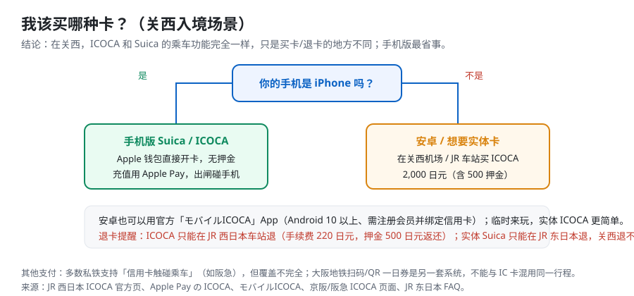

### 9.1 ICOCA 与 Suica 到底差在哪

**在关西乘车，两张卡的作用完全一样**（都符合全国相互利用服务，闸机反应、扣费金额相同）；差别只有「在哪买」「在哪退」以及手机版体验。〔S30〕〔S10〕〔S18〕

| 对比项 | ICOCA（JR 西日本） | Suica（JR 东日本） |
|---|---|---|
| 关西能买到吗 | ✅ 关西机场、JR 各站发售 | ❌ 实体卡在关东发售；关西买不到（Welcome Suica 也只在成田/羽田等发售）⚠️ |
| 关西能坐车吗 | ✅ | ✅ 完全一样 |
| 售价 | 2,000 日元（含押金 500 日元 + 可用余额 1,500 日元）〔S26〕〔S29〕〔S15〕 | 同结构（2,000 日元，押金 500）|
| 退卡地点 | JR 西日本车站（关西机场、大阪、京都的 JR 窗口） | 只能在 JR 东日本车站 |
| 退卡费 | 手续费 220 日元；余额不足时从押金扣，押金 500 日元返还〔S28〕 | 同类规则（手续费 220 日元）⚠️〔S31〕 |
| 手机版 | Apple Pay 版 ICOCA（iPhone/Apple Watch）〔S3〕；安卓有官方「モバイルICOCA」〔S4〕 | iPhone 可直接开手机版 Suica，无押金〔S30〕 |

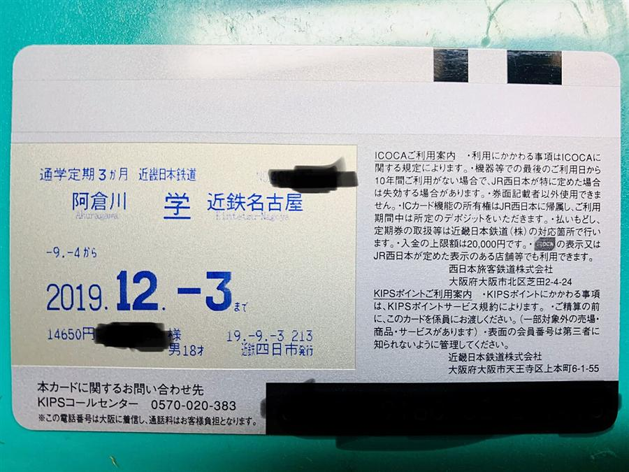

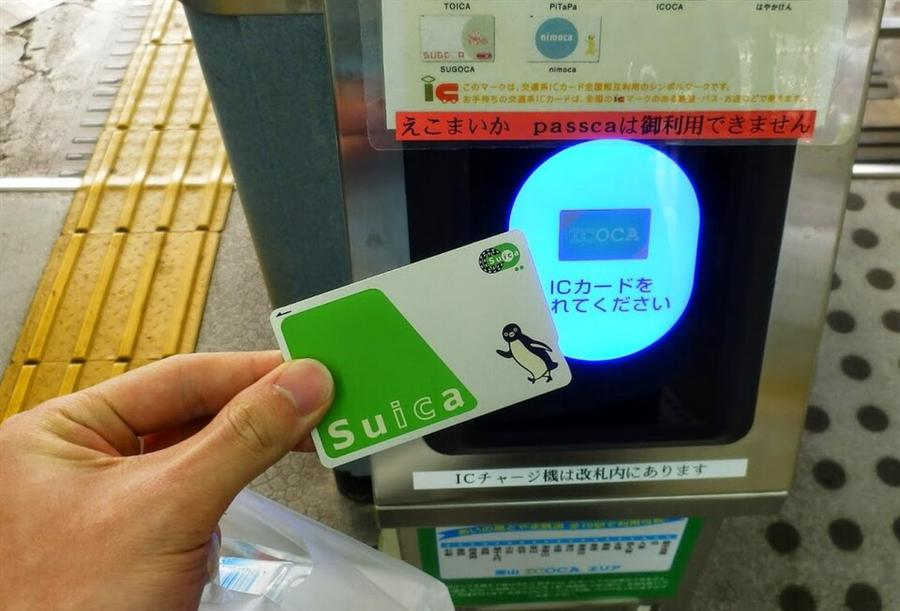

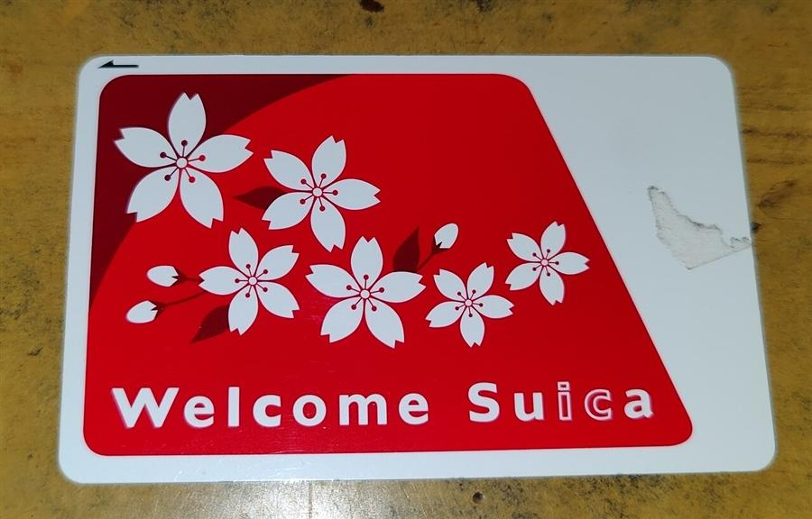

### 9.2 买卡与充值

1. 关西机场落地后，在 **JR 西日本窗口或自动售票机**买 ICOCA；也可在关西各 JR 车站购买。〔S1〕〔S26〕
2. 充值（チャージ）在车站售票机、精算机、便利店收银台都可以做；充值一般**只接受现金**或特定信用卡。〔S1〕〔S2〕
3. 卡内余额不足时不用换卡，充值后继续用。

### 9.3 退卡

- **ICOCA**：在 JR 西日本车站的绿色窗口办理。退款公式为「余额 − 手续费 220 日元 + 押金 500 日元」；**余额不足 220 日元时只退押金 500 日元**。〔S28〕
- **实体 Suica**：只能在 JR 东日本车站退；从关西离境时退不了，可留作纪念（卡内余额长期有效）⚠️。
- **手机 IC**：不存在退卡问题，直接删除卡片即可（余额可继续用或转出）。〔S3〕〔S4〕

### 9.4 什么时候不能只靠 IC 卡

| 场景 | IC 卡能不能直接进 | 正确做法 |
|---|---|---|
| 普通/快速/新快速列车 | ✅ 直接刷 | 无需额外买券 |
| 新干线 | ❌ 单独刷不进去 | 买乘车券＋特急券；或注册 スマートEX / EX-IC 用 IC 卡过闸〔S33〕〔S34〕 |
| 在来线特急（HARUKA、Rapi:t、近铁特急） | 部分可刷进闸但**必须另买特急券** | 特急券单独购买〔S5〕〔S24〕〔S22〕 |
| 全车指定席列车 | ❌ | 先订座再乘车〔S35〕〔S22〕 |
| 部分地方私铁/巴士 | ❌ 不支持全国 IC | 现场买票（本文不逐一列举）❗ |

### 9.5 一日券、周游卡、JR PASS 要不要买

| 票券 | 价格 | 什么时候值 |
|---|---|---|
| 京都地下铁 1 日券 | 800 日元〔S12〕 | 一天坐 4 段以上地铁 |
| 京都地下铁・巴士 1 日券 | 1,100 日元〔S13〕 | 一天跑 3 个以上分散景点（清水寺＋金阁寺＋岚山这种） |
| 大阪周游卡 | 1 日 3,500 / 2 日 5,000 日元〔S21〕 | 一天能进 3 个以上收费景点 |
| JR PASS（全国版） | 视天数与票价而定 | **关西一地行程一般不划算**（JR 只占一部分移动）❗ |

---

## 10. 对号入座与座位规则

### 10.1 四种座位制度

| 制度 | 怎么坐 | 会遇到的列车 |
|---|---|---|
| **自由席** | 有座就坐，票面不对号；没座就站着 | 新干线部分车次、部分特急 |
| **指定席** | 票面写「○号車 ○番」，必须坐那个位置 | 特急、新干线多数车次 |
| **全车指定席** | 全车都不能随便坐，**必须提前订座** | HARUKA〔S5〕、近铁特急〔S22〕、南海 Rapi:t〔S24〕、嵯峨野小火车〔S35〕 |
| **绿色车厢（グリーン車）** | 更宽座位，需另买绿色券 | 新干线、JR 在来线部分列车 |

### 10.2 票面怎么读

一张指定席券上通常有：**乘车日 → 列车名/号别 → 出发时间 → 出发站/到达站 → ○号車（车厢号）→ ○番（座位号）→ 吸烟/禁烟**。

上车三步：

1. 站台地面或吊牌上找**车厢号指示**（写「1号車」「2号車」的位置标）。
2. 按地面标识排在对应车厢门口。
3. 上车后按座位号找位置，行李放头顶架或座位前。

> **注意**：如果买的是自由席，进站后随便上哪节自由席车厢都可以；但**误上指定席车厢并坐下**，可能被要求补票或换位。【建议】

### 10.3 女性专用车与优先席

- **女性专用车**：大阪地铁等设有女性专用车，通常在**平日特定时段**执行，站台地面会画出车厢位置。〔S19〕
- **优先席**：JR 西日本所有通勤型车辆都设优先席，座位颜色/头套与普通席不同，便于识别；老人、孕妇、抱小孩者优先。〔S6〕

---

## 11. 遇到问题怎么办（现场处置手册）

| 状况 | 现场怎么做 | 依据 |
|---|---|---|
| 闸机不开、亮红灯 | 退到旁边 → 看屏幕提示 → 找精算机/站务员，**不要反复刷** | 〔S16〕 |
| IC 卡余额不足 | 精算机或售票机充值 → 回来重新刷卡出闸 | 〔S16〕〔S1〕 |
| 买错票 / 坐过站 | 用精算机补差价，拿新票出站；IC 卡则是「出闸时按实际区间扣费」 | 〔S16〕 |
| 进错闸机（纸票卡在 IC 闸机） | 退出队列，换到有投入口的闸机重排 | 〔S16〕 |
| 下错车 / 坐反方向 | **不要出闸**，坐反方向的车回去（同站内折返通常不额外收费；若已出闸则需重新买票）【建议】 |
| 坐错车种（快速跳过了你的站） | 在下一站下车，坐反方向普通车回来 | 【建议】 |
| 误上特急但没买特急券 | 主动找车长补票（有的车会加收费用）【建议】 | ❗ |
| 刷不了卡（感应不良） | 把卡从卡套/手机壳里拿出来，单独贴感应区再试 | 〔S10〕 |
| 卡丢了 | 记名卡（含手机卡）可挂失；无记名卡无法找回【建议】 | ❗ |
| 换乘时间不够 | 站内「乗換」指示牌 + 预留 10–15 分钟；宁可坐下一班 | 【建议】 |
| 末班车（終電） | 提前用乘换案内查末班车时间；错过只能打车（很贵） | 【建议】 |
| 台风/大雨导致停运 | 各公司官网「運行情報」页 + JR 西日本运行信息；改签或改乘替代线路 | ❗ |

> **求助话术**：把卡/票拿给对方看，说「すみません（不好意思）」+「Help」即可；大多数站务员每天处理大量外国游客的问题。【建议】

---

## 12. 中国人最容易踩的坑（校正版清单）

原始底稿列了 12 条，这里逐条校正并补充（★ 表示与常见说法不同、需要特别记住）：

1. **把 IC 卡往闸机插口塞** → IC 卡是感应的，贴顶部感应区即可。〔S1〕〔S2〕
2. **以为换乘都不用出闸** → 跨公司换乘要**先出闸再进闸**；只有同公司内部换乘和直通运转例外。〔S16〕〔S38〕
3. ★**以为「京都后门上、大阪前门上」** → **两地城市巴士都是后门上车、前门下车、下车付款**。〔S7〕〔S20〕
4. **坐巴士不按下车铃** → 不按铃可能直接过站。〔S7〕
5. **忘了拿走弹出的纸票** → 出站还要用，丢了要走人工窗口处理。〔S16〕
6. **两个人共用一张 IC 卡** → 一人一卡，不能共用。〔S10〕
7. **在电车里打电话** → 车厢内禁止通话，请静音。〔S6〕
8. ★**以为「IC 卡完全不能坐新干线」** → 单独刷确实进不去，但用 **スマートEX / EX-IC** 绑定 IC 卡后可以用 IC 卡过闸；普通买法则要买乘车券＋特急券。〔S33〕〔S34〕
9. **余额不足时反复刷卡** → 去精算机充值再回来。〔S16〕
10. **以为名字相同就是同一个站** → 大阪站 / 大阪梅田 / 梅田是不同车站；难波、京都站同理。【建议】
11. ★**在关西到处找实体 Suica** → 关西买不到实体 Suica，用 ICOCA 或手机版。〔S30〕
12. ★**从关西离境却买了实体 Suica** → Suica 只能在 JR 东日本退卡；关西退不了，要么留着下次用，要么别买。〔S28〕〔S31〕
13. **新干线带超大行李箱没预约** → 161–250cm 必须预约特大行李位，否则收 1,000 日元手续费。〔S32〕
14. **特急车随便坐** → HARUKA、近铁特急、Rapi:t 都是全车/全席指定席，必须提前订座。〔S5〕〔S22〕〔S24〕
15. **把「指定席券」当车票用** → 指定席/特急券是**加在乘车券之上**的，进闸仍需车票或 IC 卡。〔S5〕〔S24〕

---

## 13. 行前工具与话术模板

### 13.1 手机里必备的 4 个工具

| 工具 | 用途 | 备注 |
|---|---|---|
| **乘换案内（NAVITIME / Jorudan）** | 查日本境内换乘、时刻、末班车、票价 | 支持中文界面 |
| **Google 地图** | 站内步行导航、巴士到站 | 日本数据较准 |
| **JR 西日本「おでかけネット」/ JR 东日本官网** | 查官方运行信息、特急/新干线列车信息 | 停运时看这里〔S1〕〔S30〕 |
| **翻译 App（截图翻译）** | 应急看标识与公告 | 建议提前下载离线日语包 |

### 13.2 出发前把这几件事做完

- [ ] 手机开好 IC 卡（Apple Pay 版 ICOCA/Suica 或安卓モバイルICOCA），或准备好现金买实体 ICOCA。〔S3〕〔S4〕
- [ ] 需要坐新干线的日子，提前查特大行李规则并预约特大行李位。〔S32〕
- [ ] HARUKA / 利木津巴士 / 嵯峨野小火车这类**全车指定席**提前订座。〔S5〕〔S37〕〔S35〕
- [ ] 把酒店地址（日文）+ 电话号码截图保存，填表或问路时直接用。
- [ ] 截图保存本文第 14 章的对照表，离线也能看。

### 13.3 给站务员看的三句话（直接指手机屏幕）

| 中文 | 日文（可直接展示） | 用途 |
|---|---|---|
| 请帮帮我 | すみません、助けてください。 | 通用求助 |
| 我要去○○ | ○○へ行きたいです。 | 问路/问月台 |
| 我的卡刷不进去 | このカードで改札が通れません。 | 闸机问题 |

---

## 14. 中日英对照速查表（含假名读音）

### 14.1 车站与票务

| 中文 | 日文 | 假名 | 英文 |
|---|---|---|---|
| 检票口 | 改札口 | かいさつぐち | Ticket gate |
| 自动检票机 | 自動改札機 | じどうかいさつき | Automatic ticket gate |
| 换乘 | 乗換 | のりかえ | Transfer |
| 月台 | ホーム / のりば | ほーむ / のりば | Platform |
| 出口 | 出口 | でぐち | Exit |
| 补票机 | 精算機 | せいさんき | Fare adjustment machine |
| 售票机 | 券売機 | けんばいき | Ticket vending machine |
| JR 人工售票处 | みどりの窓口 | みどりのまどぐち | JR ticket office |
| 普通车票 | 乗車券 | じょうしゃけん | Basic fare ticket |
| 特急券 | 特急券 | とっきゅうけん | Limited express ticket |
| 指定席 | 指定席 | していせき | Reserved seat |
| 自由席 | 自由席 | じゆうせき | Non-reserved seat |
| 充值 | チャージ | ちゃーじ | Charge / top up |
| 余额 | 残額 | ざんがく | Balance |

### 14.2 列车与运行

| 中文 | 日文 | 假名 | 英文 |
|---|---|---|---|
| 各站停车 | 各駅停車 | かくえきていしゃ | Local |
| 快速 | 快速 | かいそく | Rapid |
| 新快速 | 新快速 | しんかいそく | Special rapid |
| 特急 | 特急 | とっきゅう | Limited express |
| 新干线 | 新幹線 | しんかんせん | Shinkansen |
| 始发 / 末班 | 始発 / 終電 | しはつ / しゅうでん | First / last train |
| 延误 | 遅延 | ちえん | Delay |
| 停运 | 運転見合わせ | うんてんみあわせ | Suspended |
| 女性专用车 | 女性専用車 | じょせいせんようしゃ | Women-only car |
| 优先座 | 優先席 | ゆうせんせき | Priority seat |

### 14.3 巴士

| 中文 | 日文 | 假名 | 英文 |
|---|---|---|---|
| 下车铃 | 降車ボタン | こうしゃぼたん | Stop button |
| 整理券 | 整理券 | せいりけん | Numbered ticket |
| 运赁箱 | 運賃箱 | うんちんばこ | Fare box |
| 后门上车 | 後ろの扉から乗車 | うしろのとびらからじょうしゃ | Board at rear |
| 前门下车 | 前の扉から降車 | まえのとびらからこうしゃ | Exit at front |

---

## 15. 来源清单、核验矩阵、图片版权与更新记录

### 15.1 来源清单（抓取日期：2026-09-11）

**官方一手（L1）**

| 编号 | 来源 | 网址 |
|---|---|---|
| S1 | JR 西日本：ICOCA 官方页 | https://www.jr-odekake.net/icoca/ |
| S2 | JR 西日本：ICOCA ご利用方法 | https://www.jr-odekake.net/icoca/guide/ |
| S3 | JR 西日本：Apple Pay の ICOCA | https://www.jr-odekake.net/icoca/applepay/ |
| S4 | JR 西日本：モバイルICOCA for Android | https://www.jr-odekake.net/icoca/mobileicoca/ |
| S5 | JR 西日本：特急はるか（车両案内，全车指定席） | https://www.jr-odekake.net/railroad/train/haruka/ |
| S6 | JR 西日本：駅や車内でのマナー啓発（优先席・车内通话） | https://www.westjr.co.jp/company/action/service/manner/ |
| S7 | 京都市交通局：市バスの乗りかた（乘降门与付款时机） | https://www2.city.kyoto.lg.jp/kotsu/webguide/ja/bus/howtoride_bus.html |
| S8 | 京都市交通局：市バス運賃 | https://www2.city.kyoto.lg.jp/kotsu/webguide/ja/fare/fare_bus.html |
| S9 | 京都市交通局：地下鉄の乗りかた（乌丸御池站内换乘） | https://www2.city.kyoto.lg.jp/kotsu/webguide/ja/tika/howtoride_tika.html |
| S10 | 京都市交通局：交通系 IC カード | https://www2.city.kyoto.lg.jp/kotsu/webguide/ja/ticket/ic_card.html |
| S11 | 京都市交通局：運賃・乗車券について（FAQ，均一区间 230 日元、方向幕判断、京津线直通、一日券） | https://www.city.kyoto.lg.jp/kotsu/page/0000204850.html |
| S12 | 京都市交通局：地下鉄 1 日券 800 日元 | https://www2.city.kyoto.lg.jp/kotsu/webguide/ja/ticket/regular_1day_card_tika.html |
| S13 | 京都市交通局：地下鉄・バス 1 日券 1,100 日元 | https://www2.city.kyoto.lg.jp/kotsu/webguide/ja/ticket/regular_1day_card_comm.html |
| S14 | Osaka Metro：運賃のご案内 | https://subway.osakametro.co.jp/guide/fare/ |
| S15 | Osaka Metro：乗車・定期運賃（地下鉄・大阪シティバス，押金 500 日元说明） | https://subway.osakametro.co.jp/guide/fare/fare/price.php |
| S16 | Osaka Metro：自動改札機をご利用ください | https://subway.osakametro.co.jp/guide/usage/automatic_ticket_gate/index.php |
| S17 | Osaka Metro：梅田 3 駅の改札外乗継（30 分钟规则） | https://subway.osakametro.co.jp/guide/fare/various_fares/transit_umeda/noritugi_3.php |
| S18 | Osaka Metro：ICOCA | https://subway.osakametro.co.jp/guide/fare/icoca/index.php |
| S19 | Osaka Metro：女性専用車両のご案内 | https://subway.osakametro.co.jp/guide/usage/female_vehicle/index.php |
| S20 | 大阪シティバス：バスの運賃／乗り方（后门上车、下车付款、210 日元） | https://citybus-osaka.co.jp/howto |
| S21 | 大阪周遊卡官方（1 日 3,500 / 2 日 5,000 日元） | https://osaka-amazing-pass.com/ |
| S22 | 近畿日本鉄道：近鉄特急のご案内（全席座席指定） | https://www.kintetsu.co.jp/gyoumu/Express/A10002.html |
| S23 | 近畿日本鉄道：きっぷの種類と発売について | https://www.kintetsu.co.jp/gyoumu/kippu/about/about.html |
| S24 | 南海电铁：特急ラピート（座位与特急券） | https://www.nankai.co.jp/traffic/express/rapit.html |
| S25 | 南海电铁：特急チケットレスサービス | https://www.nankai.co.jp/traffic/newticketless/about.html |
| S26 | 阪急电铁：ICOCA のご案内（2,000 日元含押金 500 日元） | https://www.hankyu.co.jp/ticket/stacia-pitapa/icoca.html |
| S27 | 阪急电铁：クレジットカード等（タッチ決済）のご案内 | https://www.hankyu.co.jp/ticket/touch/index.html |
| S28 | 阪急 FAQ：ICOCA を払戻ししたい（手续费 220 日元 + 押金 500 日元） | https://faq.hankyu.co.jp/print/faq/364 |
| S29 | 京阪电铁：ICOCA | https://www.keihan.co.jp/traffic/ticket/icoca.html |
| S30 | JR 东日本 FAQ：IC カードの相互利用サービス（全国互通范围） | https://jreastfaq.jreast.co.jp/category/show/30 |
| S31 | JR 东日本 FAQ：Suica 払いもどし相关（手续费 220 日元示例） | https://jreastfaq.jreast.co.jp/faq/show/980 |
| S32 | JR 东海：Luggage information / Oversized baggage（161–250cm 预约规则、未预约 1,000 日元） | https://global.jr-central.co.jp/en/info/oversized-baggage/ |
| S33 | JR 东海：エクスプレス予約（EX 服务官网） | https://expy.jp/ |
| S34 | スマート EX（新干线网络预约，IC 卡过闸） | https://smart-ex.jp/ |
| S35 | 嵯峨野観光鉄道：FAQ（全席指定席、乘车日 1 个月前发售、当日站票） | https://www.sagano-kanko.co.jp/faq |
| S36 | 嵯峨野観光鉄道：チケット / 運賃 | https://www.sagano-kanko.co.jp/ticket |
| S37 | 关西机场交通（KATE）：京都线时刻与票价（中文） | https://www.kate.co.jp/scn/timetable/detail/ky |
| S38 | 北大阪急行电铁（与 Osaka Metro 御堂筋线直通运转） | https://www.kita-kyu.co.jp/ |
| S39 | 大阪单轨电车：運賃・きっぷ・IC | https://www.osaka-monorail.co.jp/ |
| S40 | スルッと KANSAI（关西 IC 卡协议会） | https://www.surutto.com/ |
| S41 | Osaka Metro：便利なカード乗車券 | https://subway.osakametro.co.jp/guide/fare/card_tickets/index.php |
| S42 | Osaka Metro：e METRO デジタル乗車券 | https://www.osakametro.co.jp/page/digital_tickets.php |

**辅助来源（L2/L3，用于交叉印证；不作为唯一依据）**

| 编号 | 来源 | 网址 |
|---|---|---|
| S43 | JR 东日本 Suica 官方站点（本站直接抓取受限，退卡与发售状态请以该站为准） | https://www.jreast.co.jp/suica/ |
| S44 | JR 西日本 きっぷ 页面（抓取受限，购票规则以窗口/官网当日说明为准） | https://www.jr-odekake.net/railroad/ticket/ |
| S45 | 大阪周游卡（スルッと KANSAI 运营页面） | https://osaka-amazing-pass.com/ |

### 15.2 核验矩阵（关键结论 × 来源数）

| 关键结论 | 来源 | 状态 |
|---|---|---|
| 京都巴士均一区间成人 230 日元 / 儿童 120 日元 | S7・S8・S11 | ✅ 三源一致 |
| 京都巴士后门上车、前门下车、下车付款（观光特急除外：前门上、上车付） | S7・S11 | ✅ 官方两处一致 |
| 京都地下铁 220–360 日元 / 地下铁 1 日券 800 / 地下铁・巴士 1 日券 1,100 | S9・S11・S12・S13 | ✅ 三源以上一致 |
| 大阪 City Bus 后门上车、下车付款、均一 210 日元、上车不用刷卡取整理券 | S20（官方）・S15（运赁表） | ✅ 官方一致 |
| Osaka Metro 地铁 190–390 日元五档 | S14・S15 | ✅ 官方一致 |
| ICOCA 售价 2,000 日元（含押金 500 日元） | S26・S29・S15 | ✅ 三源一致 |
| ICOCA 退卡手续费 220 日元、押金 500 日元返还 | S28（官方 FAQ）・S26・S31 | ✅ 三源一致 |
| Suica/ICOCA 等 10 种交通系 IC 全国互通 | S30・S10・S18 | ✅ 三源一致 |
| 新干线特大行李 161–250cm 需预约，未预约收 1,000 日元 | S32（JR 东海官方） | ✅ 官方一手（英文版同页） |
| 新干线可用 スマートEX / EX-IC 以 IC 卡过闸 | S33・S34 | ✅ 官方一致 |
| HARUKA 全车指定席 | S5（官方车両案内）・S37 | ✅ 官方一致 |
| 近铁特急全席座位指定 | S22・S23 | ✅ 官方一致 |
| 南海 Rapi:t 指定席，车内补票加收 300 日元，チケットレス便宜 150 日元 | S24・S25 | ✅ 官方一致 |
| 嵯峨野小火车全席指定席、乘车日 1 个月前发售 | S35・S36 | ✅ 官方一致 |
| 大阪周游卡 1 日 3,500 / 2 日 5,000 日元 | S21・S45 | ✅ 官方一致 |
| 梅田 3 站改札外乘继 30 分钟规则 | S17 | ⚠️ 仅官方一处（规则明确） |
| 御堂筋线直通北大阪急行 / 东西线直通京阪京津线 | S38・S11 | ✅ 官方一致 |
| 关西买不到实体 Suica，只能在 JR 东日本退卡 | S30・S31・S43 | ⚠️ 官方站点抓取受限，按 JR 东日本口径整理 |
| 女性专用车时段与车厢位置 | S19 | ⚠️ 以站台当日标识为准 |
| 京都⇄大阪 JR 新快速约 29 分钟 | — | ❗ 未取得三源，仅作参考 |
| Thunderbird 座位构成 | — | ❗ 建议现场核对 |

### 15.3 图片版权与出处

本文档全部配图分两类：

1. **自制 SVG 图解**（10 张，文件名以 `svg-` 开头）：由本次整理绘制，可自由使用，用于解释流程与规则。
2. **公司标识与实拍照片**（34 张：16 张公司标识 + 18 张实拍）：来自 Wikimedia Commons，许可为公有领域或 CC 系列；逐张的作者、许可与原页面见 [`assets/transit/CREDITS.md`](assets/transit/CREDITS.md)。

> 标识（logo）与商标版权归各铁路/巴士公司所有，此处仅用于乘车识读说明，不代表任何隶属或授权关系。

### 15.4 更新记录

| 版本 | 日期 | 说明 |
|---|---|---|
| v1 | 2026-09-11 | 以 DeepSeek 原稿为基础重排为 15 章；补入公司标识与车站导视图解、列车种类详解、关西三大线路实操、直通运转与改札外乘继、IC 卡与特急/新干线座位规则；按官方页面校正「大阪巴士前门上车」「IC 卡完全不能坐新干线」等说法；全部关键结论给出出处并做三源核验；新增 44 张配图（10 张自制图解 + 16 张公司标识 + 18 张实拍）。 |
| v1 | 2026-09-11 | 文件集整理：原始底稿改名为 `Osaka-Kyoto-Transit-Guide-v0-Source-Original.md` 并随站点发布；本页网页与 Markdown 统一同名；补充市巴士票价制度可能调整的提醒。 |

> **更新方式**：内容有实质变化时升版本号（v1 → v2），旧版本文件保留不删除；每次更新在本表登记。
